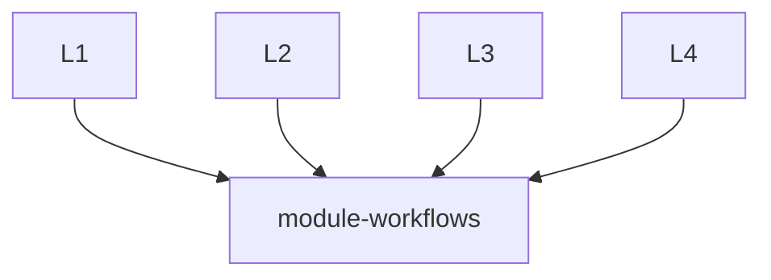

# Module Workflows
This repository provides re-usable workflows for Terraform modules.

Calling workflows in this repository is as simple as adding the following to a workflow file in the caller's repository:
```
jobs:
  call-workflow:
    uses: cartdotcom-cloudoperations/module-workflows/.github/workflows/<workflow-name>.yaml@main
    secrets: inherit
    with:
      <input>: <input-value>
```

More information about workflow re-use can be found here: https://docs.github.com/en/actions/using-workflows/reusing-workflows

## Architecture


The architecture of this repository is very straightforward. All Terraform modules in the `cartdotcom-cloudoperations` organization can remotely call the reusable workflows declared here in `module-workflows`. Some SOPs for enabling this work can be found below.

## SOPs
Because we have 400+ repositories in the `cartdotcom-cloudoperations` organization, and because each of these repositories needs to implement a calling workflow in order to take advantage of reusable workflows, it can be valuable to use a script to modify all the calling workflows simultaneously. That script can be found below.

https://github.com/cartdotcom-cloudoperations#mass-workflow-modification-script

## CI Workflow
The reusable CI workflow (`.github/workflows/CI.yaml`) abstracts the process of validating the correctness of Terraform modules before they are deployed. It also automates the release process should the CI process succeed. For more information about what's happening, view the workflow code directly.